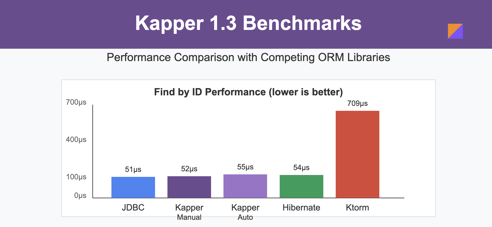

# Kapper ORM

[](https://opensource.org/licenses/Apache-2.0)
[](https://central.sonatype.com/artifact/net.samyn/kapper)

[](https://sonarcloud.io/summary/new_code?id=driessamyn_kapper)
[](https://sonarcloud.io/summary/new_code?id=driessamyn_kapper)


<p style="font: italic bold 20px sans-serif;padding-top:7px;line-height: 1.6;">SQL is not a problem to be solved - it's a powerful tool to be embraced.<br />
This is the philosophy behind Kapper...</p>

<br clear="left" />

Kapper is a lightweight, Dapper-inspired ORM (Object-Relational Mapping) library written in Kotlin, targeting the JVM ecosystem.
It embraces SQL rather than abstracting it away, providing a simple, intuitive API for executing queries and mapping results.

## The Kapper Philosophy

Instead of adding another abstraction layer, Kapper embraces three core principles:

1. **SQL is the Best Query Language**: SQL has evolved over decades to be expressive, powerful, and optimized for database operations.
Instead of hiding it, we should leverage it directly.
2. **Minimal Abstraction**: Kapper provides just enough abstraction to make database operations comfortable in Kotlin, without trying to reinvent database interactions. 
Kapper prefers extension of existing APIs than abstraction of them.
3. **Transparency**: What you write is what gets executed.
There's no magic query generation or hidden database calls.

Kapper aims to go against the grain of the heavyweight database abstractions.
Instead, it makes JDBC support easy without taking away any flexibility.
In fact, it can happily live alongside an existing _vanilla_ JDBC integration and/or your existing DB layer.

It does _not_ generate code, it does not introduce another layer of abstraction, it is never intrusive.
It does _not_ hide SQL, instead it embraces the fact that SQL is the best language for DB interaction.

Kapper also means hairdresser in Dutch, but I have yet to come up with a reason for why this is relevant.

## Features

- **Simple API**: Kapper provides a familiar set of methods for executing SQL queries, mapping results to Kotlin data classes, and updating/inserting data.
- **Extensibility**: The Kapper API is implemented as extension functions on the `java.sql.Connection` interface, allowing seamless integration with existing JDBC code.
- **Lightweight**: Kapper has minimal external dependencies, focusing on providing core functionality without bloat.
- **Fast**: Kapper's extension design means that it is possible to match "raw" JDBC performance, while its [auto-mapper equals or outperforms other ORMs](./benchmark/README.md).
- **Supported DBs**: PostgreSQL, MySQL, SQLite, Oracle, MS SQL Server.



Snapshot releases are published from the main branch to [GitHub Packages](packages/2353016).
Stable releases will be published to Maven Central.

## Usage Overview

Here's a simple example of how to use Kapper:

Example DB table
```sql
 CREATE TABLE super_heroes (
    id UUID PRIMARY KEY,
    name VARCHAR(100),
    email VARCHAR(100),
    age INT
);
 ```

and an example DTO:
```kotlin
data class SuperHero(val id: UUID, val name: String, val email: String? = null, val age: Int? = null)
```

You can use Kapper like so:
```kotlin
// Assuming you have a java.sql.Connection instance, using your favourite connection pooler, for example:
ds.getConnection().use { connection ->
    // insert a row:
    connection.execute(
        "INSERT INTO super_heroes(id, name, email, age) VALUES(:id, :name, :email, :age);",
        "id" to UUID.randomUUID(),
        "name" to "Batman",
        "email" to "batman@dc.com",
        "age" to 85,
    )
    
    // Execute a SQL query and map the results to a list of SuperHero objects
    val heroes: List<SuperHero> = connection.query<SuperHero>("SELECT * FROM super_heroes")

    // or query by passing parameters
    val olderHeroes = connection.query<SuperHero>("SELECT * FROM super_heroes WHERE age > :age", "age" to 80)
    
    // or find a single
    val batman = connection.querySingle<SuperHero>(
        "SELECT id, name FROM super_heroes WHERE name = :name",
        "name" to "Batman",
    )
}
```

Kapper does not maintain a mapping between classes and DB tables or entities. 
Instead, it can either map to a given class if the constructor arguments match the DB fields, or a mapping lambda can be passed in.
This means Kapper provides a strongly typed mapping, but still allows rows-to-object mapping with lambdas or mapper functions for more flexibility or advanced used cases.

Further examples and documentation are explored below and in the [integration tests](lib/src/integrationTest/kotlin/net/samyn/kapper/), or check out the [Kapper-Example](https://github.com/driessamyn/kapper-examples) repo for more extended examples and documentation,
including [a comparison with Hibernate and Ktorm](https://github.com/driessamyn/kapper-examples/tree/release-1.0-article?tab=readme-ov-file#comparison-with-orms).

## How to use Kapper

### Import dependencies

Stable versions of Kapper are published to [Maven Central](https://central.sonatype.com/artifact/net.samyn/kapper/versions).
To use this in your project, simply add the following dependency to your `build.gradle.kts` (or the Groovy equivalent in `build.gradle`):

```kotlin
dependencies {
    implementation("net.samyn:kapper:<version>")
}
```

For Maven, use:

```xml
<dependency>
    <groupId>net.samyn</groupId>
    <artifactId>kapper</artifactId>
    <version>[VERSION]</version>
</dependency>
```

For co-routine support (see below), use `kapper-coroutines` instead.

Snapshot releases are published from the `main` branch to [GitHub packages](./packages).

In order to use these, add GitHub packages as a repository (and ensure `GH_USERNAME` and `GH_TOKEN` are set in your environment):
```kotlin
repositories {
    mavenCentral()
    maven {
        name = "GitHubPackages"
        url = uri("https://maven.pkg.github.com/driessamyn/kapper")
        credentials {
            username = project.findProperty("gh.user") as String? ?: System.getenv("GH_USERNAME")
            password = project.findProperty("gh.key") as String? ?: System.getenv("GH_TOKEN")
        }
    }
}
```

### Basic usage

#### Queries

Kapper can auto-map the results of a SQL query to a data class:

```kotlin
data class SuperHero(val id: UUID, val name: String, val email: String? = null, val age: Int? = null)

val heroes = dataSource.connection.use {
    it.query<SuperHero>("SELECT * FROM super_heroes")
}
```

Parameters can optionally be passed to the query by prefixing the query template tokens with `:`,`?` or `$` and providing the values as key-value pairs:

```kotlin
val olderHeroes = dataSource.connection.use {
    it.query<SuperHero>(
        "SELECT * FROM super_heroes WHERE age > :age",
        "age" to 80,
    )
}
```

Kapper also support using a custom mapper in case auto-mapping cannot be used or is not desired.
This is done by simply passing a mapper function to the query, using a lambda or a function reference:

```kotlin
val heroAges =
    dataSource.connection.use {
        it.query<Pair<String, *>>(
            "SELECT * FROM super_heroes WHERE age > :age",
            { resultSet, fields ->
                Pair(
                    resultSet.getString(fields["name"]!!.columnIndex),
                    resultSet.getInt(fields["age"]!!.columnIndex),
                )
            },
            "age" to 80,
        )
    }
}
```

The `querySingle` function can be used to return a single result, or null if the query returns no results:

```kotlin
val batman =
    dataSource.connection.use {
        it.querySingle<SuperHero>(
            "SELECT * FROM super_heroes WHERE name = :name",
            "name" to "Batman",
        )
    }
```

#### Execute

Kapper provides an `execute` function to execute SQL statements that do not return a result set, such as `INSERT`, `UPDATE`, or `DELETE` statements.

For example:

```kotlin
datasource.connection.use {
    it.execute(
        """
            INSERT INTO super_heroes(id, name, email, age) 
            VALUES (:id, :name, :email, :age)
            """.trimIndent(),
        "id" to UUID.randomUUID(),
        "name" to "Batman",
        "email" to "batman@dc.com",
        "age" to 85,
    )
}

datasource.connection.use {
    it.execute(
        """
            UPDATE super_heroes
            SET age = 86
            WHERE name = :name
            """.trimIndent(),
        "name" to "Batman",
    )
}

datasource.connection.use {
    it.execute(
        """
                DELETE FROM super_heroes
                WHERE name = :name
                """.trimIndent(),
        "name" to "Batman",
    )
}
```

### DB Transactions

Kapper provides extension functions to make working with transactions easier.

The `withTransaction` function on `Connection` starts a transaction, executes the provided block, and commit the transaction if the block completes successfully.
The same function on `DataSrouce` behaves the same except it also creates (and closes) the connection.

For example:

```kotlin
datasource.connection.withTransaction { connection ->
    // insert a row:
    connection.execute(
        "INSERT INTO super_heroes(id, name, email, age) VALUES(:id, :name, :email, :age);",
        "id" to UUID.randomUUID(),
        "name" to "Batman",
        "email" to "batman@dc.com",
        "age" to 85,
    )
}
```

is the equivalent of:

```kotlin
datasource.withTransaction { connection ->
    // insert a row:
    connection.execute(
        "INSERT INTO super_heroes(id, name, email, age) VALUES(:id, :name, :email, :age);",
        "id" to UUID.randomUUID(),
        "name" to "Batman",
        "email" to "batman@dc.com",
        "age" to 85,
    )
}
```

### Coroutine support

Kapper supports coroutines with the inclusion of the `kapper-coroutines` module:

```kotlin
dependencies {
    implementation("net.samyn:kapper-coroutines:<versions>")
}
```

#### Executing on a `Dispatcher`

This module provides an extension function `withConnection` on the `DataSource` object, optionally allowing you to specify a `Dispatcher`.
If no `Dispatcher` is provided, the default `Dispatchers.IO` is used.

For example:

```kotlin
suspend fun listHeroes(): List<SuperHero> =
    dataSource.withConnection {
        // Kapper query runs on Dispatchers.IO
        it.query<SuperHero>("SELECT * FROM super_heroes")
    }
```

### Returning a `Flow`

The `queryAsFlow` function in the `kapper-coroutines` module returns a `Flow` of the results, allowing for easy integration with other coroutines constructs, and for example allowing a query to be cancelled:

```kotlin
runBlocking {
    val job =
        async {
            getDataSource(postgresql).withConnection { connection ->
                connection.queryAsFlow<PopularMovie>(
                    """
                    SELECT
                     title,
                     release_date as releasedate, 
                     gross_worldwide as grossed
                    FROM movies 
                    ORDER BY gross_worldwide DESC
                    """.trimIndent(),
                )
                .runningFold(0L to emptyList<PopularMovie>()) { (totalGross, movieList), movie ->
                    val newTotal = totalGross + movie.grossed
                    newTotal to (movieList + movie)
                }.takeWhile { (totalGross, _) ->
                    // query will be cancelled here
                    totalGross <= 10_000_000_000
                }.last()
            }
        }
    println("Query started")
    val popularMovies = job.await()
    println(
        "Popular movies are: ${popularMovies.second.map { it.title }}, " +
            "grossing a total of ${String.format("%,d", popularMovies.first)}",
    )
}
```

Note that running a query that returns a very large number of results and filtering them in the `Flow` may not be the most efficient way to handle this.
Filtering in the DB query itself is generally more efficient.
The above only serves as an example of how to use `Flow` with Kapper and the ability to cancel queries.

The `queryAsFlow` function optionally takes a `fetchSize` parameter, which can be used to set the fetch size of the underlying JDBC statement.
When not set, the fetch size is set to 1,000.
This allows Kapper to cancel the JDBC `Statement` when the `Flow` is cancelled, _and_ if supported by the JDBC driver itself.

See [Kapper-Example](https://github.com/driessamyn/kapper-examples) for additional examples.

> **Note**: operations on the JDBC drivers are blocking.
> This means that regardless of the coroutine support, the actual DB operations are blocking and the connection remains open until the operation is completed.
> See [Coroutine support in Kapper 1.1](https://dev.to/driessamyn/coroutine-support-in-kapper-11-45h9) for more information.

## Database support

Kapper's integration tests currently cover Postgresql, MySQL, SQLite, Oracle and MS SQL Server.
If you need support for another DB, and/or find an issue with a particular DB, feel free to [open an issue](kapper/issues) or, even better, submit a pull request. 

The integration tests by default execute against Postgresql, SQLite, but the `-Ddb` property can be used to specify other DB targets.
E.g.:

```shell
./gradlew integrationTest -Ddb=oracle
```

Or to run against _all_ supported DBs:

```shell
./gradlew integrationTest -Ddb=all
``` 

## Performance

Kapper is designed to be fast and lightweight, with performance comparable to raw JDBC.
This repository contains a [benchmark suite](./benchmark) that compares Kapper's performance against other popular ORMs like Hibernate and Ktorm.
The benchmark suite is designed to be extensible and can be used to add new benchmarks or modify existing ones.
Two Kapper benchmarks are included: with auto-mapping and with a custom mapper.
In Kapper 1.3, the _"cost"_ of auto-mapping is in the small single digit microsecond range.

More details can be found [here](./benchmark/README.md), and the benchmark results are published in [kapper-benchmark-results](https://github.com/driessamyn/kapper-benchmark-results/).

# External content

- [Dev.to - Kapper, a Fresh Look at ORMs for Kotlin and the JVM ](https://dev.to/driessamyn/kapper-a-fresh-look-at-orms-for-kotlin-and-the-jvm-1ln5)
- [Dev.to - Coroutine support in Kapper 1.1](https://dev.to/driessamyn/coroutine-support-in-kapper-11-45h9)
- [Dev.to - Announcing Kapper 1.2: Cleaner Transactions with Less Boilerplate](https://dev.to/driessamyn/announcing-kapper-12-cleaner-transactions-with-less-boilerplate-2dbi)
- [Dev.to - Kapper 1.3 Supports Flows](https://dev.to/driessamyn/kapper-13-supports-flows-more-kotlin-goodness-47f0)
- [Dev.to - Kapper benchmarks - how does Kapper 1.3 compare to the competition?](https://dev.to/driessamyn/kapper-benchmarks-how-does-kapper-13-compare-to-the-competition-1m4d)

## Roadmap

The following items were part of the v1 roadmap and are planned for future releases.
Items will be ticked off as they are implemented.

- [x] Create a benchmark suite to validate performance.
- [x] Create transaction syntax sugar.
- [x] Add co-routine support.
- [x] Add flow support.
- [x] Add MS SQL Server, Oracle and SQLite integration tests.
- [ ] Support auto-mapping for Java records.
- [ ] Cache query parsing.
- [ ] Custom SQL type conversion.
- [ ] Improve support for date/time conversion.
- [ ] Support DTO argument for `execute`.
- [ ] Add support for non-blocking JDBC drivers.
- [ ] Bulk operations support
- [ ] Improve user documentation.
- [ ] Tests & examples in other JVM languages.

Anything else you think is missing, or you want to be prioritised, please [open an issue](kapper/issues) or submit a pull request.

## Contributing

We welcome contributions to the Kapper! If you find any issues or have ideas for improvements, please feel free to [open an issue](kapper/issues) or submit a pull request.

## License

_Kapper_ is released under the [Apache 2.0 License](./LICENSE).
