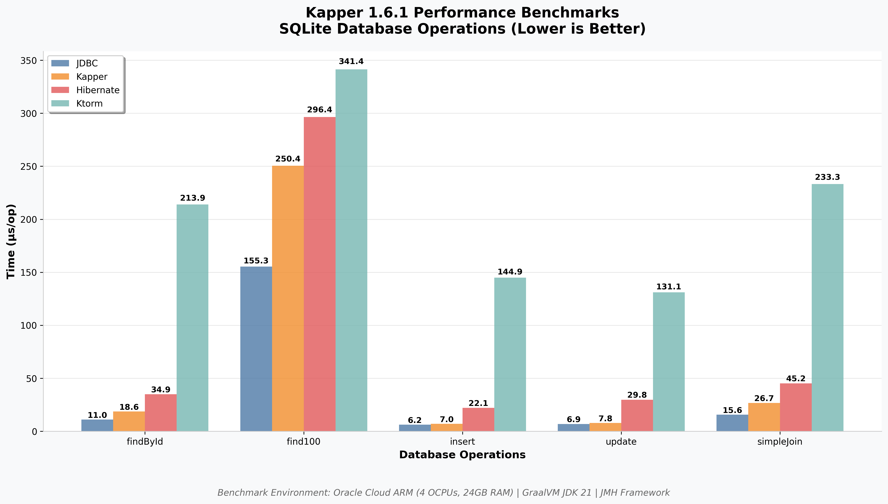

# Kapper

[](https://opensource.org/licenses/Apache-2.0)
[](https://central.sonatype.com/artifact/net.samyn/kapper)

[](https://sonarcloud.io/summary/new_code?id=driessamyn_kapper)
[](https://sonarcloud.io/summary/new_code?id=driessamyn_kapper)


<p style="font: italic bold 20px sans-serif;padding-top:7px;line-height: 1.6;">SQL is not a problem to be solved - it's a powerful tool to be embraced.<br />
This is the philosophy behind Kapper...</p>

<br clear="left" />

Kapper is a lightweight, Dapper-inspired ORM (Object-Relational Mapping) library written in Kotlin, targeting the JVM ecosystem. It embraces SQL rather than abstracting it away, providing a simple, intuitive API for executing queries and mapping results.


See [Kapper](https://driessamyn.github.io/kapper/) for more information.

## Philosophy

Instead of adding another abstraction layer, Kapper embraces three core principles:

1. **SQL is the Best Query Language**: SQL has evolved over decades to be expressive, powerful, and optimised for database operations. Instead of hiding it, we should leverage it directly.

2. **Minimal Abstraction**: Kapper provides just enough abstraction to make database operations comfortable in Kotlin, without trying to reinvent database interactions. Kapper prefers extension of existing APIs rather than abstraction of them.

3. **Transparency**: What you write is what gets executed. There's no magic query generation or hidden database calls.

📖 [Read more about Kapper's philosophy](https://driessamyn.github.io/kapper/guide/philosophy)

## Features

- **🎯 SQL-First Approach**: Write your SQL directly - no DSL or query builders
- **⚡ High Performance**: Near-JDBC performance with automatic object mapping
- **🏗️ Auto-Mapping**: Automatically map result sets to Kotlin data classes and Java records
- **🔧 Custom Mappers**: Full control with manual mapping for performance-critical paths
- **🚀 Coroutines Support**: First-class support for Kotlin coroutines with `kapper-coroutines`
- **🌊 Flow Integration**: Return query results as Kotlin `Flow` for reactive programming
- **📦 Java Records**: Native support for Java record classes alongside Kotlin data classes
- **🔄 Transactions**: Simple transaction handling with automatic commit/rollback
- **📊 Bulk Operations**: Efficient batch inserts, updates, and deletes with `executeAll`
- **🗄️ Database Support**: PostgreSQL, MySQL, SQLite, Oracle, MS SQL Server, and many others
- **📏 Minimal Dependencies**: Lightweight library with zero external dependencies
- **🔌 JDBC Extension**: Extends `java.sql.Connection` - works alongside existing JDBC code

[📖 Explore all features in detail](https://driessamyn.github.io/kapper/guide/)

## Quick Start

```kotlin
data class User(val id: UUID, val name: String, val email: String?)

// Simple query
val users = connection.query<User>("SELECT * FROM users WHERE age > :age", "age" to 18)

// Insert data
connection.execute(
    "INSERT INTO users(id, name, email) VALUES(:id, :name, :email)",
    "id" to UUID.randomUUID(),
    "name" to "Alice",
    "email" to "alice@example.com"
)
```

## Performance That Speaks for Itself

<div align="center">
  
</div>

Kapper consistently outperforms other ORMs while maintaining the simplicity and transparency of SQL.

## 📚 Complete Documentation

Discover everything Kapper can do for your project! Visit our comprehensive documentation site:

**📖 [kapper.samyn.net](https://driessamyn.github.io/kapper)**

### What you'll find:

- **🚀 [Quick Start Guide](https://driessamyn.github.io/kapper/guide/quick-start)** - Get up and running in minutes
- **📖 [User Guide](https://driessamyn.github.io/kapper/guide/)** - Complete feature coverage with examples
- **💻 [Working Examples](https://driessamyn.github.io/kapper/examples/)** - Real-world patterns and best practices
- **⚡ [Performance Benchmarks](https://driessamyn.github.io/kapper/performance/)** - See how Kapper compares to other ORMs
- **🔧 [Installation Guide](https://driessamyn.github.io/kapper/guide/installation)** - Maven, Gradle, and dependency setup
- **🔄 [Migration Guide](https://driessamyn.github.io/kapper/guide/migration)** - Migrating from other ORMs
- **📚 [API Reference](https://driessamyn.github.io/kapper/api/)** - Complete API documentation

## Contributing

We welcome contributions! Please see our [documentation site](https://driessamyn.github.io/kapper) for guides and examples, or feel free to [open an issue](https://github.com/driessamyn/kapper/issues) or submit a pull request.

## License

Kapper is released under the [Apache 2.0 License](./LICENSE).