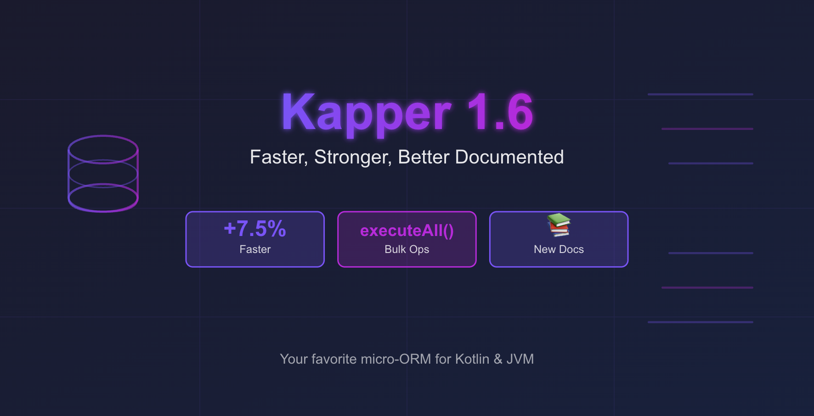

# Kapper 1.6: Faster Performance, Bulk Operations, and a Brand New Documentation Site



We're excited to announce Kapper 1.6! 
Since the [1.5 release](https://driessamyn.github.io/kapper/blog/05_kapper_1-5_records_support.html), we've been hard at work delivering some highly requested features and performance improvements. 

Here's what's new:

- **7.5% faster** mapping performance with optimized reflection code
- New `execute` API that accepts DTOs as arguments
- Bulk operations with the new `executeAll` API
- A brand new [documentation website](https://driessamyn.github.io/kapper/)

## Performance improvements

In search of even better performance, and with support from the kind people at [YourKit](https://www.yourkit.com/) who provided a free copy of the YourKit profiler, we went on a mission to find where the biggest performance improvements could be made.

Unsurprisingly, the biggest overhead Kapper has compared to _raw_ JDBC is the reflection-based auto-mapping.
In particular, a few of the Kotlin reflection APIs are slow(ish) even compared to the Java APIs.

Improvements were found by refactoring the reflection-based mapping and adding a caching layer for the most costly operations, resulting in a **[7.5% average improvement](https://driessamyn.github.io/kapper/performance/)** in the benchmarks compared to the previous version.

There are still some inefficiencies in the Kotlin reflection library, which means that mapping to Java records is marginally faster than to Kotlin data classes. Keep in mind that we're talking fractions of a microsecond per mapping operation. When those microseconds matter, we always suggest using [custom mappers](https://driessamyn.github.io/kapper/guide/mapping.html#custom-mappers), but in most real-world cases, the extra few microseconds probably don't matter.

In any case, Kapper outperforms other ORMs, including Hibernate.

## Execute with DTO

Previously, Kapper's execute API required passing in values for named parameters individually.
For example:

```kotlin
dataSource.connection.use {
    it.execute(
        """
        INSERT INTO super_heroes(id, name, email, age) 
        VALUES (:id, :name, :email, :age)
        """,
        "id" to UUID.randomUUID(),
        "name" to "Wonder Woman",
        "email" to "wonder@dc.com",
        "age" to 3000
    )
}
```

This felt like a natural API to us, but based on user feedback, we added a new extension that allows DTOs to be passed in directly.
Now you can pass your DTO and map its properties:

```kotlin
val hero = SuperHero(UUID.randomUUID(), "Flash", "flash@dc.com", 28)

dataSource.connection.use {
    it.execute(
        "INSERT INTO super_heroes(id, name, email, age) VALUES(:id, :name, :email, :age)",
        hero,
        "id" to SuperHero::id,
        "name" to SuperHero::name,
        "email" to SuperHero::email,
        "age" to SuperHero::age
    )
}
```

## Bulk uploads with executeAll

The addition of the DTO API for execute made it easy to support bulk updates or inserts using the same pattern:

```kotlin
val users = listOf(
    User(null, "User 1", "user1@example.com", 25),
    User(null, "User 2", "user2@example.com", 30),
    User(null, "User 3", "user3@example.com", 35)
)

val results = connection.executeAll(
    "INSERT INTO users(name, email, age) VALUES(:name, :email, :age)",
    users,
    "name" to User::name,
    "email" to User::email,
    "age" to User::age
)
```

This API is recommended when multiple inserts or updates are required in the same operation.
Kapper uses JDBC's [batch statement](https://docs.oracle.com/javase/8/docs/api/java/sql/Statement.html#addBatch-java.lang.String-) features to execute this efficiently.

## Brand-new documentation website

Kapper's simple and intuitive API didn't require much documentation initially, but the repo's README had outgrown its purpose.
Based on user feedback, and with a helping hand from a friendly LLM, we created a dedicated documentation website that includes a getting started guide as well as an overview of all examples: **[driessamyn.github.io/kapper](https://driessamyn.github.io/kapper/)**

The examples have also been migrated from their dedicated repo to the main [Kapper repository](https://github.com/driessamyn/kapper), making everything easier to find and maintain.

## What's next?

Let us know what you think, what's missing, or what you'd like to see next.
You can open an issue on [GitHub](https://github.com/driessamyn/kapper) or reach out to us directly.

Let 2026 be the year developers fall in love with SQL again and adopt Kapper as their favorite micro-ORM for Kotlin and the JVM!
